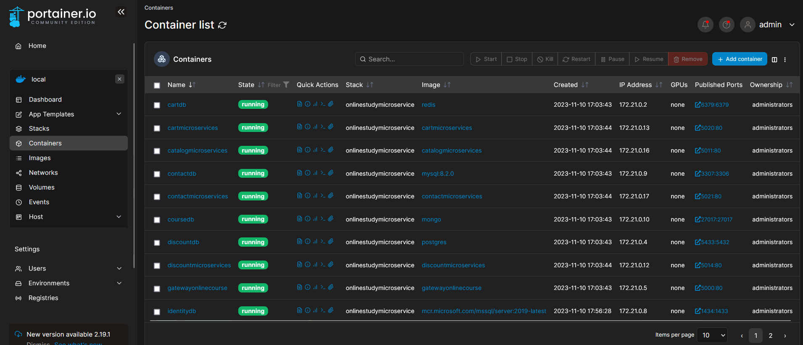

# OnlineStudyMicroService

# Online Study Microservice Project

This project serves as the backbone of an online learning platform, employing a multitude of architectural and design principles, including Domain-Driven Design (DDD), N-tier architecture, Dapper, CQRS, the Repository Pattern, and DTO models. It encompasses various microservices, such as "order," "payment," "identity server," "catalog," and others, and interacts with five different database systems: MongoDB, SQL Server, MySQL, Redis, and PostgreSQL, all running within Docker containers. The Ocelot framework is utilized as the gateway, and RabbitMQ serves as the message queue for efficient communication between microservices.

## Getting Started

To run this project locally, ensure you have the following prerequisites:

- [Docker](https://www.docker.com/)
- [Docker Compose](https://docs.docker.com/compose/)

Follow these installation steps:

1. Clone the project repository:

   ```sh
   git clone https://github.com/your-project-url.git
   cd project-folder-name](https://github.com/yunusy78/OnlineStudyMicroService.git)
Start the project using Docker Compose:

docker-compose up -d


## Architectural and Design Choices
Domain-Driven Design (DDD)
This project follows the principles of DDD to model the various business domains within the online learning platform. Domain-driven design concepts are applied to define clear boundaries, aggregate roots, entities, and value objects for each domain.

N-Tier Architecture
The project is structured following the N-tier architectural pattern, providing separation between presentation, business logic, and data access layers. This architectural choice ensures modularity and scalability.

Dapper
Dapper is employed as the data access technology. Dapper is a micro ORM (Object-Relational Mapping) that allows for efficient interaction with databases while providing fine-grained control over SQL queries.

CQRS (Command Query Responsibility Segregation)
The CQRS pattern is implemented to separate command and query responsibilities within the application. Commands for creating or updating data are kept separate from queries for retrieving data, ensuring a more streamlined and efficient data flow.

Repository Pattern
The Repository Pattern is used to abstract and encapsulate the data access logic. This pattern allows for clean and structured data access while promoting testability and maintainability.

Data Transfer Objects (DTO)
DTOs are employed to transfer data between different layers of the application. They act as a container for the data that needs to be transferred between microservices or between the application and its clients.

## Microservices
The project comprises several microservices, each dedicated to specific functionality:

Order Service: Manages order-related operations.
Payment Service: Handles payment processing.
Identity Server: Manages user authentication and identity.
Catalog Service: Manages course catalog information.
For in-depth information and usage guides for each microservice, consult their respective README files.

## Databases
The project integrates five different database systems, each with its specific configuration:

MongoDB
SQL Server
MySQL
Redis
PostgreSQL
Connection settings and configuration details for each database can be found in their respective README files.

## Gateway and Message Queue
Gateway: Ocelot serves as the primary gateway, with detailed configuration information available in its respective README.
Message Queue: RabbitMQ is employed as the message queuing system to facilitate efficient communication between microservices. Relevant documentation is provided for message queue control.
Data Visualization and MVC
The project adheres to the Model-View-Controller (MVC) architectural pattern for data visualization and user interface. Details on MVC implementation and user interface aspects are elaborated upon in the README files.

## Usage Scenarios
To understand how the project functions, explore example scenarios such as:

Creating an order
Making a payment
And more.
Contributing
If you'd like to contribute to this project, please follow these steps:

Fork the repository and clone it to your local machine.
Make your changes.
Commit your changes and open a pull request.
License


Contact
If you have any questions or feedback regarding the project, please feel free to reach out to us at [yunusy@uia.no].
Feel free to copy and paste this extended template into your README.md file and tailor it furt

## Images

)





